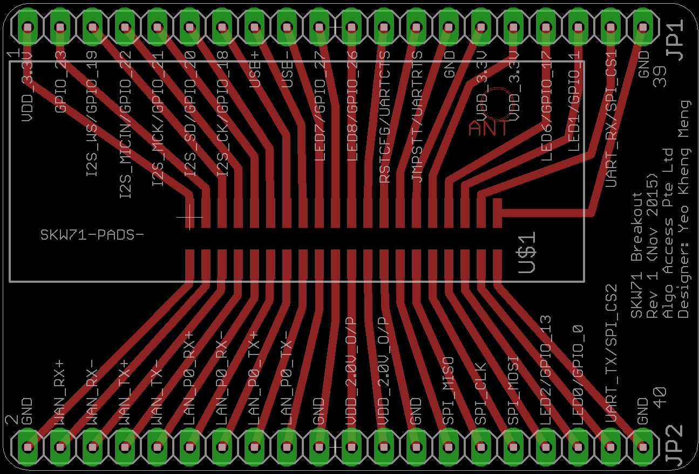
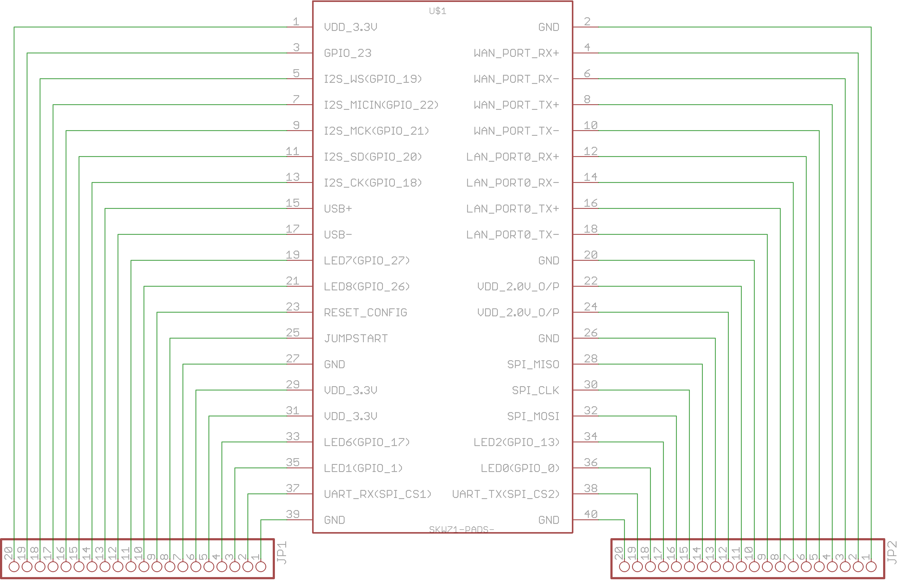

# pcb-breakout-skw71
Pin breakout of the Skylab SKW71 AR9331-based module to through-hole pin headers for prototyping.

##PCB Design software and addons used

1. Eagle 7.5.0: I use Standard but Light should still be able to open/modify the files.
2. SKW71 library by [DIY modules](https://github.com/baseapp/EagleLibrary) (in repo as BaseApp.lbr)

##Images

None yet

##Schematic drawings
Images are exported from Eagle at 600dpi.

##Parts required

1. SKW71 Module which can be bought from Aliexpress [here](http://www.aliexpress.com/store/product/Skylab-Access-Point-WiFi-modules-SKW71-WIFI-Module-Integrates-internal-AP-and-LNA-Client-Repeater-10pcs/100058_2003437490.html)
2. 20-pin, 2-row, 1.27mm pitch receptacle like [this](http://sg.element14.com/samtec/fle-120-01-g-dv/product-range-fle-series/dp/1667674)
